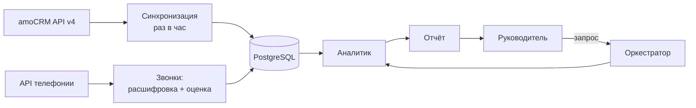

# Тестовое задание CityCar: AI-анализ отдела продаж

Запрос руководителя: "Проанализируй работу отдела продаж за последние 30 дней". Данные: amoCRM и записи звонков из телефонии.

## 1. Архитектура

Главная идея: цифры считает код, а не LLM, и данные собираются заранее, а не в момент вопроса. Модель нужна только там, где без неё никак: понять звонок и написать текст.



- **Синхронизация CRM** (без LLM). amoCRM API v4: `/leads`, `/tasks`, `/events` (смены этапов), `/users`, `/leads/pipelines`. Раз в час тянем только изменённое по `updated_at`, у amo лимит 7 запросов в секунду.
- **Звонки.** Если телефония подключена к amo, ссылка на запись уже есть в примечании о звонке и сразу понятно, к какой сделке он относится. Если нет, берём журнал из API телефонии и сопоставляем по номеру. Короткие звонки и недозвоны не расшифровываем, но считаем. Расшифровка через Whisper на своём сервере или Yandex SpeechKit, потом LLM оценивает звонок по чек-листу РОПа и возвращает JSON с цитатами. Всё это в фоне: за месяц набираются тысячи звонков, по запросу их не расшифровать.
- **Оркестратор** (LLM) разбирает запрос: период, весь отдел или конкретный менеджер. Дальше идёт по фиксированному плану, чтобы отчёты каждый месяц были одинаковые и их можно было сравнить.
- **Аналитик.** SQL считает конверсию по этапам, время на этапе, сделки без задач и с просрочкой, звонки и пропущенные по каждому менеджеру. LLM смотрит на готовые цифры и ищет связи, например "конверсия ниже и в большинстве звонков нет следующего шага".
- **Отчёт** (LLM). 3-5 выводов и таблица по менеджерам, у каждого вывода ссылки на сделки и звонки, чтобы руководитель мог проверить.

**Хранение:** PostgreSQL (копия CRM, звонки, расшифровки, оценки, прошлые отчёты). Аудио не храним, только ссылку на запись.

## 2. Что сама система, а что человек

Система сама выгружает данные, расшифровывает и оценивает звонки, считает метрики, находит проблемные сделки, пишет черновик отчёта и может напомнить менеджеру о просроченной задаче.

Человеку остаются решения по людям (премии, штрафы), спорные звонки, на которых модель не уверена, любые изменения в CRM (система только предлагает) и чек-лист для оценки звонков. Первые недели РОП сверяет оценки системы со своими на паре десятков звонков.

**Три риска:**

1. **Мусор в CRM.** Если сделки не двигают и задачи закрывают для галочки, система посчитает неправильные цифры. Поэтому в отчёте есть блок про качество данных и прямо пишется, где вывод сделать нельзя.
2. **Ошибки расшифровки и выдумки LLM.** Отсюда правило: числа считает код, у оценки звонка есть цитата, РОП выборочно проверяет.
3. **Персональные данные (152-ФЗ).** Записи звонков нельзя просто так отправлять в зарубежный API. Нужны модели на своём сервере, российские сервисы или обезличивание текста. Решать с юристом до запуска.

## 3. Код

[`amo_stale_deals.py`](amo_stale_deals.py), 48 строк, Python + requests.

```bash
AMO_SUBDOMAIN=yourcompany AMO_TOKEN=... python amo_stale_deals.py
```

Забирает все незакрытые задачи по сделкам, для каждой сделки запоминает ближайший срок, потом проходит по открытым сделкам (без статусов 142 и 143) и выводит те, где задач нет или срок прошёл. Два списка целиком вместо запроса на каждую сделку: так пара десятков запросов вместо тысячи. Пагинация и ответ `204` на пустой выборке учтены.

Проверял на подменённых ответах API, живого аккаунта amo не было.

## 4. Мой AI-проект

**Разбор споров в платёжном шлюзе (NOMAPAY).** Клиент пишет, что оплатил, но деньги не зачислились, и прикладывает чек. Раньше оператор сам читал чек и сверял его с ордером, на один спор уходило около 20 минут. Я встроил в процесс ИИ-модель через OpenRouter API: она достаёт данные из чека, а сверку с апелляционным ордером делает код. Если всё сходится, спор закрывается сам, если нет или модель не уверена, он уходит оператору.

Результат: 80% проверок проходят без оператора, разбор спора занимает около минуты вместо 20.

Стек: Go, PostgreSQL, OpenRouter API.

Рядом с этим я сделал **сервис поддержки** на Go: по обращению он сам находит нужную транзакцию и отправляет тикет в нужный Telegram-чат. Среднее время обработки тикета упало с 10 минут до 1.

Для себя ещё собрал агента на Claude Code, который откликается на вакансии: отбирает их на hh.ru, getmatch.ru и hirify.me, пишет сопроводительные и перед отправкой показывает текст мне.

## 5. Чему научился за полгода

Работать с AI-агентами: писать инструкции так, чтобы агент делал предсказуемо, знал свои границы и останавливался спросить. Применил в агенте для откликов из пункта 4.

Ещё подтянул Python-бэкенд (основной у меня Go): FastAPI, async SQLAlchemy, Elasticsearch.

## 6. Улучшение, которое я довёл до конца

В Регнанс базу уязвимостей для продукта обновляли вручную: выгрузить данные из PostgreSQL по 12 источникам (CVE, BDU ФСТЭК, GHSA и другие), собрать около 500 тысяч JSON-записей и запушить в репозиторий. На это уходило примерно 8 часов в неделю. Я предложил это автоматизировать и сделал сам: потоковый ETL на Go, который запускается в Kubernetes по расписанию и пушит в GitLab, только если база правда изменилась. Самым сложным оказались ручные правки в базе: полная перегенерация их затирала, пришлось сделать так, чтобы они сохранялись.

Итог: 8 часов ручной работы в неделю ушли, база обновляется сама.
